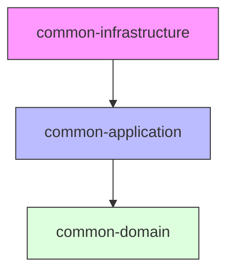

# 📚 LXP Common Library 문서 

## 🏗️ 1. 상황별 활용 가이드 (Quick Reference Map)
> 개발 중인 패키지 위치와 상황에 따라 어떤 클래스를 상속/구현해야 하는지 한눈에 확인하세요.

| 내가 작업 중인 위치 | 직면한 상황 (When) | 활용해야 할 라이브러리 (What) |
| --- | --- | --- |
| **`domain.model`** | 새로운 엔티티(Table)를 설계할 때 | `BaseEntity`, `AggregateRoot` 상속 |
|  | 값 객체(VO)를 정의할 때 | `ValueObject` 상속 (equals 자동화) |
| **`domain.service`** | 복잡한 비즈니스 규칙(유효성 검사)을 짤 때 | `BusinessRule` 구현, `Validator` 호출 |
|  | 검색 조건이 너무 많아 `if-else`가 복잡할 때 | `Specification` 패턴 조합 (AND/OR) |
| **`application.service`** | 서비스를 만들 때 (Command/Query 분리) | `CommandUseCase`, `QueryUseCase` 구현 |
|  | 서비스 간 결합 없이 로직을 호출하고 싶을 때 | `CommandBus`, `QueryBus` 디스패치 |
| **`adapter.in.web`** | Controller에서 성공 응답을 내릴 때 | `ApiResponse.success()` |
|  | 예외를 발생시켜야 할 때 | `throw new DomainException(ErrorCode)` |
| **`adapter.out.persistence`** | DB 테이블에 생성일/수정일/ID가 필요할 때 | `BaseJpaEntity`, `BaseUuidJpaEntity` |
|  | 데이터를 물리 삭제하지 않고 숨김 처리할 때 | `BaseSoftDeleteJpaEntity` (`.delete()`) |
|  | Controller의 페이징 요청을 DB 쿼리로 넘길 때 | `PageConverter.toSpringPageable()` |
>
## 💎 2. 도메인 계층 (Domain Layer) - `common-domain`

> 의존성: 순수 Java (Spring 사용 금지)
>

2.1 모델링의 기초

- **엔티티(Entity) 정의:** `BaseEntity<ID>` 활용법
- **값 객체(VO) 정의:** `ValueObject` 활용법
- **애그리거트 루트:** `AggregateRoot`와 이벤트 등록(`registerEvent`)

2.2 비즈니스 로직과 규칙

- **비즈니스 룰 검증:** `BusinessRule` 인터페이스와 `BusinessRuleValidator`
- **동적 쿼리 명세:** `Specification` 패턴과 `CompositeSpecification`
- **도메인 예외 처리:** `DomainException`과 `ErrorCode` 정의 표준

2.3 프레임워크 독립적인 유틸리티

- **페이지네이션:** 도메인 전용 `Page`, `Slice`, `Sort`, `PageRequest`

---

## ⚙️ 3. 애플리케이션 계층 (Application Layer) - `common-application`

> 의존성: common-domain 참조
>

3.1 유스케이스 표준 (Ports & UseCases)

- **입력 포트(In):** `UseCase`, `CommandUseCase`, `QueryUseCase`
- **출력 포트(Out):** `DomainEventPublisher`, `IntegrationEventPublisher`

3.2 CQRS 패턴 구현

- **명령(Command):** `Command` 마커, `CommandBus`, `CommandHandler`
- **조회(Query):** `Query` 마커, `QueryBus`, `QueryHandler`

3.3 이벤트 주도 설계

- **통합 이벤트(Integration):** `IntegrationEvent` (시스템 간 통신)
- **이벤트 핸들러:** `DomainEventHandler` vs `IntegrationEventHandler`

---

## 🛠️ 4. 인프라 계층 (Infrastructure Layer) - `common-infrastructure`

> 의존성: common-application, Spring Boot, JPA
>

4.1 웹 API 표준화

- **응답 래퍼:** `ApiResponse<T>` 사용법
- **에러 핸들링:** `GlobalExceptionHandler`와 `ErrorResponse` 자동 매핑
- **설정:** `DomainService` 어노테이션 스캔 설정 (`DomainServiceConfig`)

4.2 영속성(Persistence) 가이드

- **JPA Base 엔티티:**
    - `BaseJpaEntity`: 기본 (ID + Audit)
    - `BaseSoftDeleteJpaEntity`: 논리 삭제 지원
    - `BaseUuidJpaEntity`: UUID 식별자
    - `BaseVersionedJpaEntity`: 낙관적 락 지원 (`@Version`)
- **페이지 변환기:** `PageConverter` (Domain ↔ Spring Data 변환)

4.3 신뢰성 및 메시징

- **재시도 전략:** `@Retryable` AOP와 `RetryPolicy`
- **트랜잭셔널 아웃박스:** `OutboxEvent` 엔티티와 발행 메커니즘
- **버스 구현체:** `SimpleCommandBus`, `SimpleQueryBus` (자동 빈 매핑)

---

# 📘 LXP Common Library 개발자 가이드 (v1.0)

> 문서 목적: LXP 프로젝트의 아키텍처 원칙(Hexagonal, CQRS)을 준수하면서도, 반복적인 설정 작업을 제거하여 개발 생산성을 높이는 공통 모듈 활용법을 정의합니다.
>

## 🏗️ 0. 모듈 구조 및 의존성 원칙

이 라이브러리는 엄격한 의존성 규칙을 가집니다. **화살표 반대 방향으로 참조하지 않도록 주의하세요.**



- **🟢 common-domain**: 순수 Java. 비즈니스 로직의 핵심. (Spring 금지 🚫)
- **🔵 common-application**: 흐름 제어 인터페이스. (Port, UseCase, CQRS)
- **🔴 common-infrastructure**: Spring, JPA, 외부 연동 구현체.

---

## 🚀 1. 빠른 시작 (Quick Start)

1.1 컨트롤러 표준 (API Response & Exception)

성공 시엔 `ApiResponse`, 실패 시엔 `DomainException`만 기억하세요. `try-catch`로 에러를 직접 잡아서 리턴하지 마십시오.

**✅ Good Code:**

```java
@RestController
@RequiredArgsConstructor
public class CourseController {

    private final CreateCourseUseCase createCourseUseCase;

    @PostMapping("/api/v1/courses")
    public ApiResponse<Long> createCourse(@RequestBody CreateCourseRequest request) {
        // UseCase 실행
        Long courseId = createCourseUseCase.execute(request.toCommand());
        
        // 성공 응답 포장
        return ApiResponse.success(courseId);
    }
}
```

**✅ Error Handling:**

```java
// Service 내부
if (courseRepository.existsByName(name)) {
    // GlobalExceptionHandler가 자동으로 409 Conflict로 변환하여 응답함 [web:5]
    throw new CourseDomainException(CourseErrorCode.DUPLICATE_NAME);
}
```

---

### 💎 2. 도메인 모델링 (Domain Layer)

**2.1 Entity & VO 정의**

모든 엔티티는 `BaseEntity`를, 값 객체는 `ValueObject`를 상속받아 `equals/hashCode` 구현 실수를 방지합니다.

```java
// Entity: ID로 식별
public class Member extends BaseEntity<Long> {
    private MemberId id;
    // ...
    @Override
    public Long getId() { return id.getValue(); }
}

// VO: 속성값으로 식별
public class Address extends ValueObject {
    private String city;
    private String street;

    @Override
    protected Object[] getEqualityComponents() {
        return new Object[]{city, street}; // 이 값들이 같으면 같은 객체
    }
}
```

**2.2 비즈니스 규칙 검증 (`BusinessRule`)**

`if`문이 난무하는 검증 로직을 클래스로 분리하여 재사용성을 높입니다.

```java
// 규칙 정의
public class DiscountPeriodRule implements BusinessRule {
    @Override
    public boolean isBroken() {
        return LocalDate.now().isAfter(endDate);
    }
    @Override
    public String getMessage() { return "할인 기간이 종료되었습니다."; }
}

// 사용 (Domain Service/Entity 내부)
BusinessRuleValidator.validate(new DiscountPeriodRule(this.endDate));
```

---

### 🗄️ 3. 데이터 영속성 (Infrastructure Layer)

**3.1 JPA Entity 상속 전략**

DB 테이블 설계 목적에 따라 적절한 Base 클래스를 선택하세요.

| 클래스 | 용도 | 자동 관리 컬럼 |
| --- | --- | --- |
| `BaseJpaEntity` | 일반 데이터 | `id`, `createdAt`, `updatedAt` |
| `BaseSoftDeleteJpaEntity` | 삭제 이력 보존 | 위 필드 + `deleted`, `deletedAt` |
| `BaseUuidJpaEntity` | 보안 식별자 필요 | `id(UUID)`, `createdAt`, `updatedAt` |

**3.2 페이지네이션 (`PageConverter`)**

Domain의 `Page`는 Spring을 모르고, JPA의 `Page`는 Domain을 모릅니다. 이 둘을 연결할 때

`PageConverter`를 사용합니다.

```java
// Infrastructure (Adapter)
public Page<Course> findAll(PageRequest request) {
    // 1. Domain PageRequest -> Spring Pageable
    Pageable pageable = PageConverter.toSpringPageable(request);
    
    // 2. JPA Query
    org.springframework.data.domain.Page<CourseEntity> jpaPage = jpaRepository.findAll(pageable);
    
    // 3. Spring Page -> Domain Page
    return PageConverter.toDomainPage(jpaPage).map(mapper::toDomain);
}
```

---

### ⚡ 4. 고급 패턴 (CQRS & Event)

**4.1 Command/Query Bus 사용**

복잡한 의존성 주입 없이, 의도(Command/Query)만 던지면 알아서 핸들러가 실행됩니다.

```java
// Controller
private final CommandBus commandBus;

public ApiResponse<Void> cancel(Long orderId) {
    // 핸들러를 찾을 필요 없이 버스에 태움
    commandBus.dispatch(new CancelOrderCommand(orderId));
    return ApiResponse.success();
}
```

**4.2 트랜잭셔널 아웃박스 (Event Publisher)**

이벤트를 발행하면 **자동으로 DB(`outbox_events`)에 저장**됩니다. (별도 설정 불필요)

개발자는 `DomainEventPublisher`만 호출하면 됩니다.

```java
@Service
@Transactional
public class OrderService {
    private final DomainEventPublisher eventPublisher;

    public void placeOrder(Order order) {
        repository.save(order);
        
        // 이 시점에 DB insert(order)와 insert(outbox)가 한 트랜잭션으로 묶임 [web:6]
        eventPublisher.publishAndClear(order); 
    }
}
```

---

### 🛑 5. 주의사항 (Do's and Don'ts)

1. **Domain 패키지 오염 금지:** `com.lxp.common.domain` 패키지 내부에서는 절대로 `org.springframework.*` 등을 import 하지 마세요. 순수 Java여야 합니다.
2. **DTO 변환 위치:** Controller에서 받은 Request DTO는 **Command 객체**로 변환하여 Service(UseCase)로 넘깁니다. Service는 DTO를 알면 안 됩니다.
3. **Entity 직접 노출 금지:** `ApiResponse`에 Entity를 바로 담지 마세요. 반드시 DTO로 변환하여 반환합니다.

---

### 🔄 6. 라이브러리 업데이트 가이드

이 라이브러리는 모든 마이크로서비스가 공유합니다. 수정이 필요할 경우 다음 절차를 따릅니다.

1. **하위 호환성 유지:** 기존 메서드를 삭제하지 말고 `@Deprecated` 처리 후 신규 메서드를 추가하세요.
2. **버전 명시:** `build.gradle`의 버전을 올리고 `CHANGELOG.md`에 변경 내역을 기록하세요.
3. **테스트 필수:** `common-lib` 자체의 단위 테스트를 통과해야 합니다.